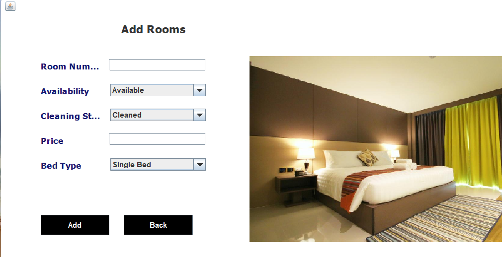

# Hotel_management_System

A Desktop Based application that allows the hotel manager to handle  all hotel activites online . Interactive  GUI
and the ability to manage rooms, employees , drivers and customers .

## *STACK USED* : Java Core , Swing , JDBC , MySQL

####   

####   

####   

####   

####   

####   

####   

